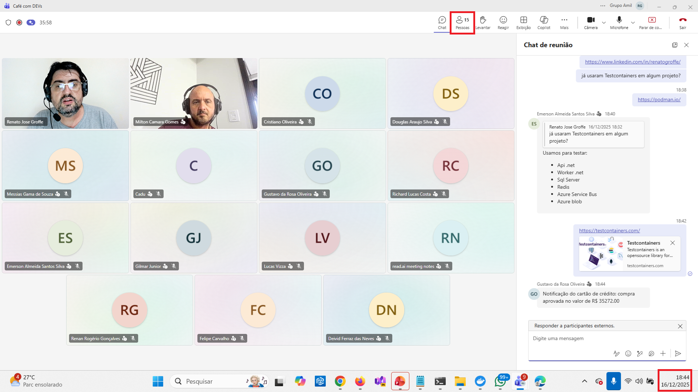
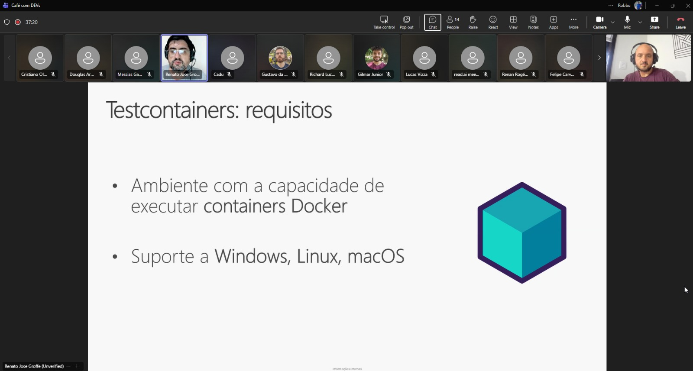
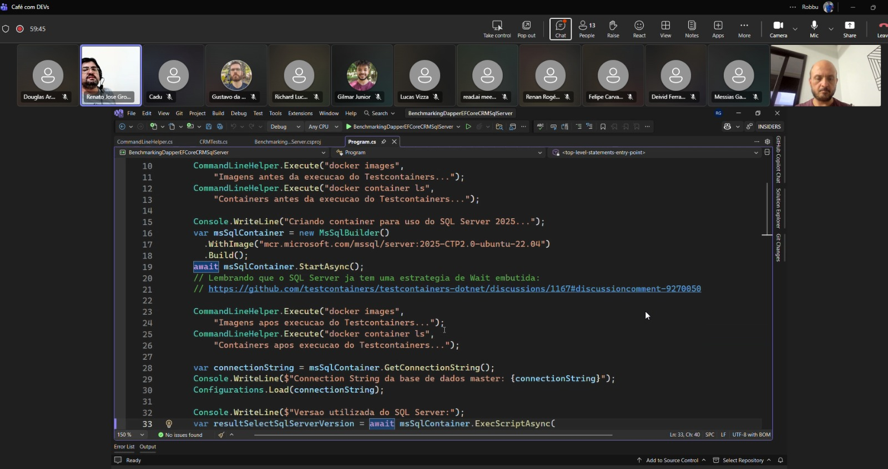
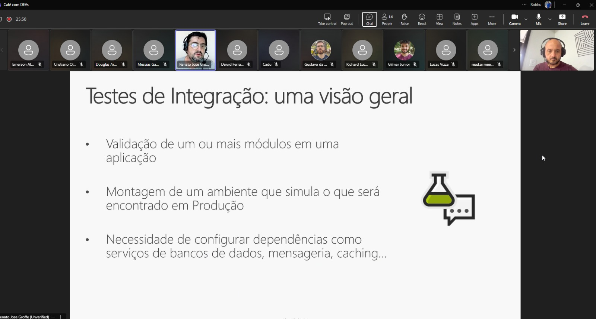
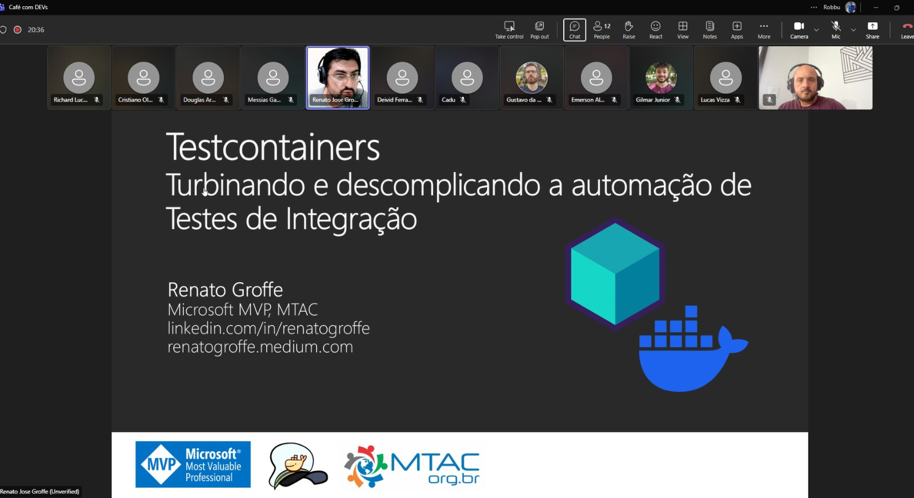

# testcontainers_robbu-2025-12
Slides e conteúdos de apresentação sobre Testcontainers. Palestra realizada no dia 16/12/2025, em evento para profissionais da Robbu Tecnologia.

Exemplos utilizados:
- Comparando a performance de Dapper x Entity Framework x ADO com SQL Server em .NET 10: https://github.com/renatogroffe/dotnet10-benchmarkdotnet-azuredevops-testcontainers-sqlserver
- Chat com IA Generativa + Microsoft Foundry/Azure OpenAI + SQL Server + Microsoft Agent Framework + Application Insights: https://github.com/renatogroffe/dotnet10-agent-sqlserver-testcontainers-otel-azureappinsights_consultaprodutos

---

## Informações sobre o evento

Título da apresentação: **Testcontainers: turbinando e descomplicando a automação de Testes de Integração**

Data: **16/12/2025 (terça-feira)**

Tipo do evento: **Online**

Ferramenta de transmissão: **Microsoft Teams**

Tecnologias e tópicos abordados: **Containers, Testes de Integração, Docker, Testcontainers, .NET 10, C#, SQL Server, Azure DevOps, Azure Pipelines, Linux, Microsoft Foundry, Microsoft Agent Framework, Dapper, ADO.NET, Entity Framework Core, OpenTelemetry, Azure Application Insights...**

Número de participantes: **15 pessoas**

Acesse este [**link**](/img/) para visualizar todas as fotos/prints da apresentação.

Deixo aqui meus agradecimentos ao meu amigo **Milton Camara Gomes (Microsoft MVP)** por todo o apoio para que participássemos deste evento interno da [**Robbu Tecnologia**](https://robbu.global/home/)

---

